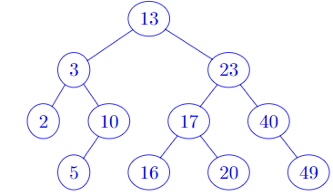

# Trees

Trees in Computer Science is reversed to what we know. The Root sits at the top, while the leaves are in the bottom.

# Binary Trees(BT)

A Binary Tree is a tree data structure in which each node has at most two children that are referred to as the left 
child and the right child. 

Each node in the binary tree has an integer value. However, all values in a binary tree are not sorted. Next, you will 
see the binary search tree that values of all nodes are sorted in some way.

# Binary Search Trees(BST)
A Binary Tree with the following properties:

1. Let x be a node in a binary tree.
2. If y is a node in the left subtree of x then y.key ≤ x→key
3. If y is a node in the right subtree of x then x→key ≤ y.key

Let's look at an example of a binary search tree:

## search in a binary tree
We use the properties of a binary search for searching an element, i.e. an integer.
The search starts from the root and the search goes to either the left subtree or the right subtree based on the key.

Example, search 20 in the binary tree above.
1. Root is the node with key 13.
2. Key 13 is less than 20, go to the right subtree. The key of the right subtree is 23.
3. Key 23 is more than 20, go to the left subtree. The key of the left subtree is 17. 
4. Key 17 is more than 16, go to the right subtree. The key of the right subtree is 16
5. Search is done. Alternatively, the search is done without finding the 16 if there is no subtree to be explored.

There is no guarantee for the search in a binary search tree, because we don't know the height of a binary search tree,
which could be N for the worst case, where N is the number of items in the binary search tree.

Red Black Trees:

Self Balancing Binary search Trees, guarantee a search performance of O(log(n)). Look at slides and Red Black Tree 
section for further information

